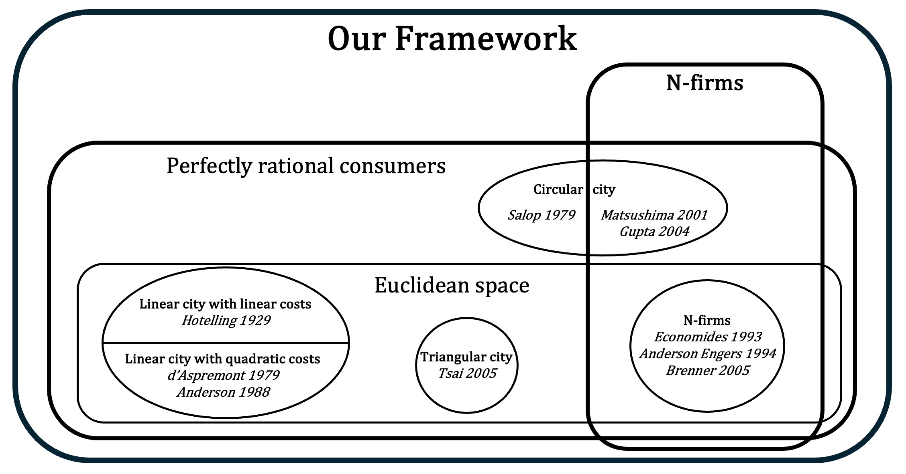
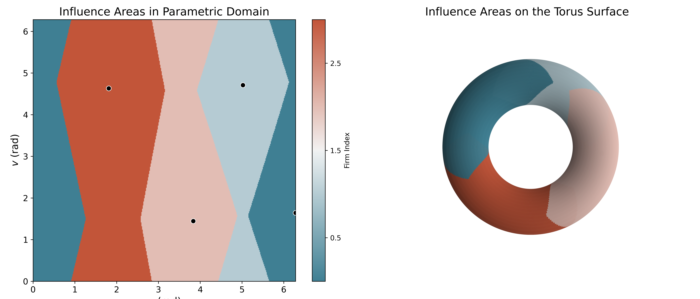
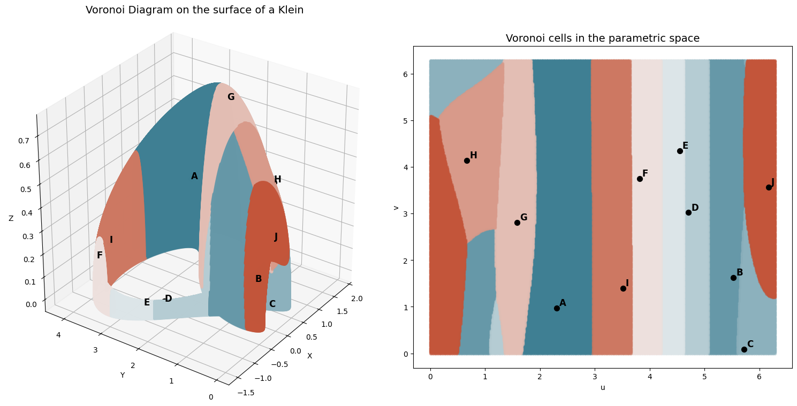
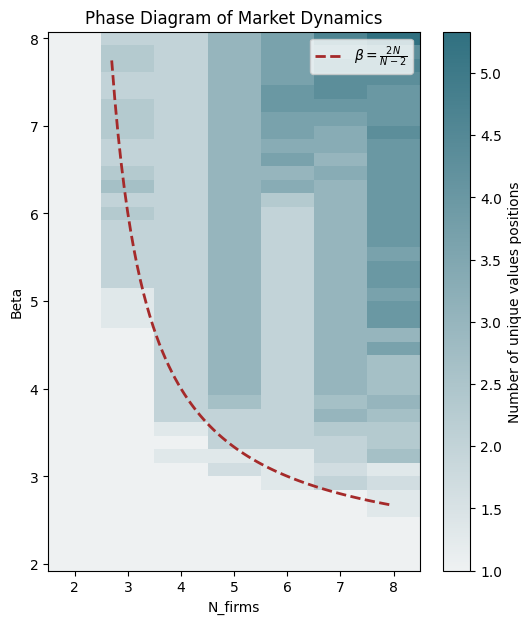

---

##### Download

+ [Paper and mathematical appendices (arXiv)](https://arxiv.org/abs/2507.01985)
---

##### Abstract

We introduce a new microeconomic model of horizontal differentiation that unifies and extends previous developments inspired by Hotelling’s (1929) seminal work. Our framework incorporates boundedly rational consumers, an unlimited number of firms, and arbitrary differentiation spaces with Riemannian manifolds. We argue that Riemannian geometry provides a natural and powerful tool for analyzing such models, offering fresh insights into firm behavior and market structure with complex products.

*Currently submitting the paper to Econometrica.*

---

##### Figure 1: Our framework in the existing literature



##### Figures (3, 5): Some manifolds and market configurations




##### Figure 6: Phase diagram on the market equilibrium on $[0,1]$




---

##### Citation

##### arXiv preprint

Labarthe, A., & Kerzreho, Y. (2025). A unified model of horizontal differentiation with general spaces and irrational consumers. arXiv preprint arXiv:2411.16464. https://arxiv.org/abs/2411.16464

```BibTeX
@misc{labarthe2025hotelling,
    title={A unified model of horizontal differentiation with general spaces and irrational consumers},
    author={Aldric Labarthe and Yann Kerzreho},
    year={2025},
    eprint={2507.01985},
    archivePrefix={arXiv},
    primaryClass={q-fin.MF},
    url = {https://arxiv.org/abs/2507.01985}
}
```

<!-----

##### Related material

+ [Presentation slides](presentation2.pdf)
+ [Wikipedia entry](https://en.wikipedia.org/wiki/The_Finer_Points_of_Sausage_Dogs)-->
