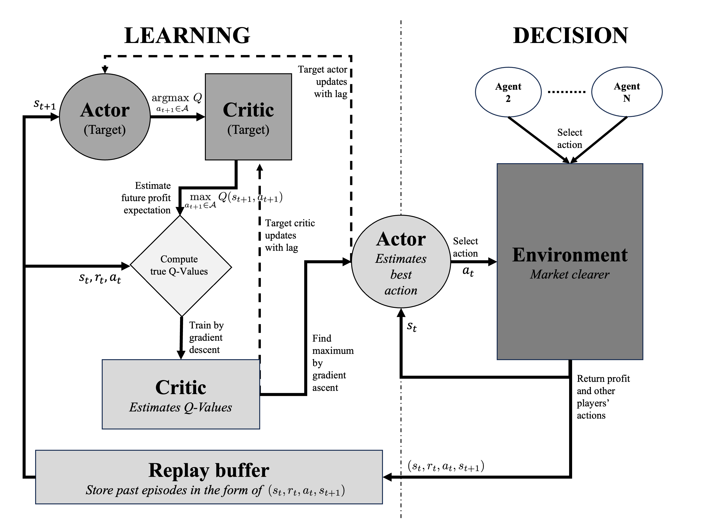
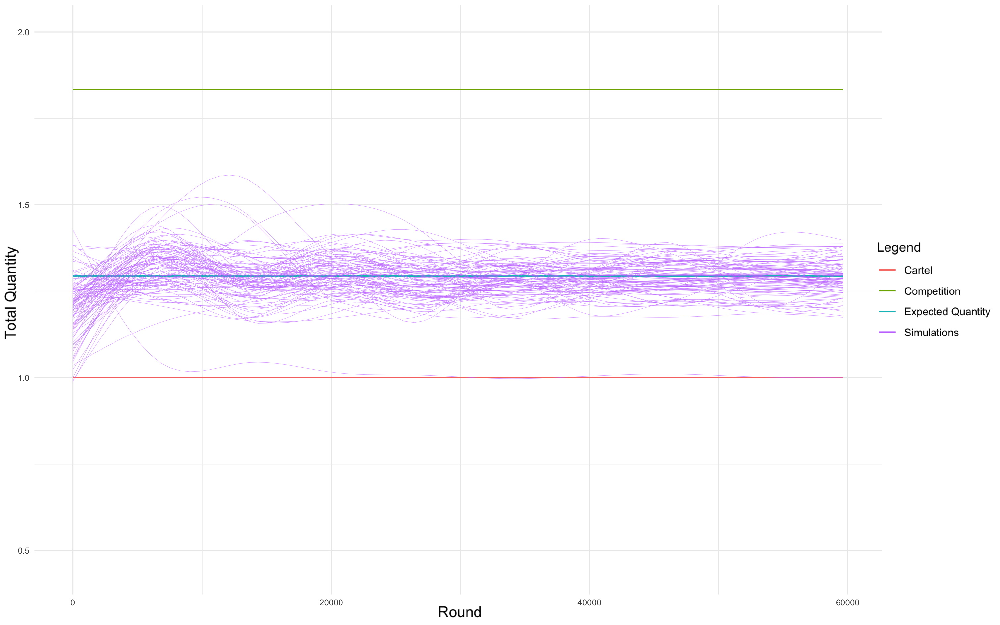
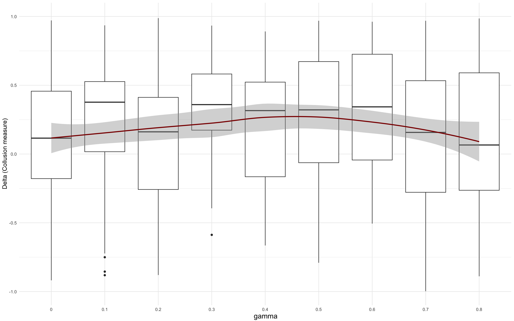

---

##### Download

+ [Thesis and mathematical appendices](https://github.com/Aldric-L/DDPG-Oligopolies-Simulator/blob/main/Strategies%20and%20equilibria%20on%20selected%20markets.pdf)
+ [Code and simulator](https://github.com/Aldric-L/DDPG-Oligopolies-Simulator)
+ [Defense (slides)](DefenseALABARTHE.pdf)

<!--+ [Data](https://1drv.ms/f/s!An5zxDZ6MkIwo4JOOjl38hN-FeKA-A?e=pnTXqT)-->
---

##### Abstract

In this paper, we introduce the first agent-based model of competition in quantities featuring a *Deep Deterministic Policy Gradient* (DDPG) algorithm. This algorithm has been selected as a replacement for the traditional Q-Learning algorithm to examine two current unsolved questions in the economic literature: the tendency of algorithmic markets to converge toward a collusive equilibrium, and the chaotic behavior of the dynamic Cournot oligopoly. We show that the DDPG algorithm is a relevant tool to model oligopolies with independent learning agents. We find that our model consistently converges toward the Nash-equilibrium in every market structure we have tested, except for the Cournot oligopoly with well-tuned parameters. We estimate the effect of these parameters on the decision process and explain why collusion may occur in this situation. Overall, we show that algorithmic collusion remains an exception when algorithmic complexity increases. We also place our model in chaotic settings and find that the chaotic behavior of the dynamic Cournot model was only theoretical and never observed in simulations.

---

##### Research evolution

This work is my master thesis for my master's degree at Ecole Normale Supérieure de Paris-Saclay (France). I'm currently working with Pr. Julien Randon-Furling to improve the thesis and rewrite it as a journal paper. 

---

##### Figure 1: Our RL-algorithm design



##### Figure 2: Our simulations have not necessarily shown collusive behaviors



##### Figure 3: Collusion is not entirely determined by the trade-off present exploitation-future rewards



---

##### Citation

```BibTeX
@mastersthesis{Labarthe_2024,
    author = {Aldric Labarthe},
    date-added = {2024-04-22 16:42:42 +0200},
    school = {Ecole Normale Sup{\'e}rieure Paris-Saclay},
    title = {Strategies and equilibria on selected markets: a multi-agent simulation and stochastic modeling approach},
    year = {2024}}
```

<!-----

##### Related material

+ [Presentation slides](presentation2.pdf)
+ [Wikipedia entry](https://en.wikipedia.org/wiki/The_Finer_Points_of_Sausage_Dogs)-->
