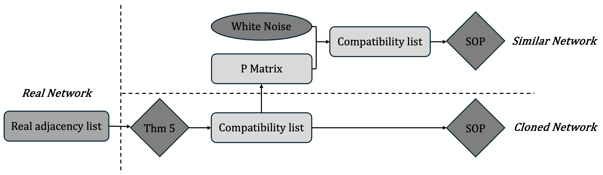

---

##### Download

+ [Paper and mathematical appendices (arXiv)](https://arxiv.org/abs/2411.16464)
+ [Code and generator](https://github.com/Aldric-L/Generating-social-networks-utility-maximization)
+ [Data](https://1drv.ms/f/s!An5zxDZ6MkIwo4JOOjl38hN-FeKA-A?e=pnTXqT)

---

##### Abstract

In this paper, we introduce a conceptual framework that model human social networks as an undirected dot-product graph of independent individuals. Their relationships are only determined by a cost-benefit analysis, i.e. by maximizing an objective function at the scale of the individual or of the whole network. On this framework, we build a new artificial network generator in two versions. The first fits within the tradition of artificial network generators by being able to generate similar networks from empirical data. The second relaxes the computational efficiency constraint and implements the same micro-based decision algorithm, but in agent-based simulations with time and fully independent agents. This latter version enables social scientists to perform an in-depth analysis of the consequences of behavioral constraints affecting individuals on the network they form. This point is illustrated by a case study of imperfect information. 

---

##### Figure 1: Our clonage and regeneration algorithm



---

##### Citation

Labarthe, A., & Kerzreho, Y. (2024). Generating social networks with static and dynamic utility-maximization approaches. arXiv preprint arXiv:2411.16464. https://arxiv.org/abs/2411.16464

```BibTeX
@misc{labarthe2024generating,
    title={Generating social networks with static and dynamic utility-maximization approaches},
    author={Aldric Labarthe and Yann Kerzreho},
    year={2024},
    eprint={2411.16464},
    archivePrefix={arXiv},
    primaryClass={math.PR},
    url = {https://arxiv.org/abs/2411.16464}
}
```

<!-----

##### Related material

+ [Presentation slides](presentation2.pdf)
+ [Wikipedia entry](https://en.wikipedia.org/wiki/The_Finer_Points_of_Sausage_Dogs)-->
