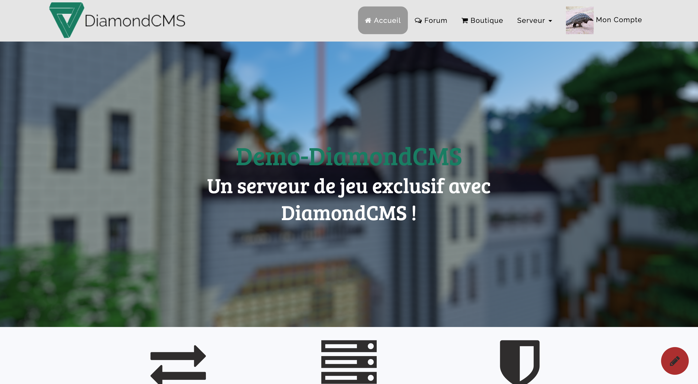
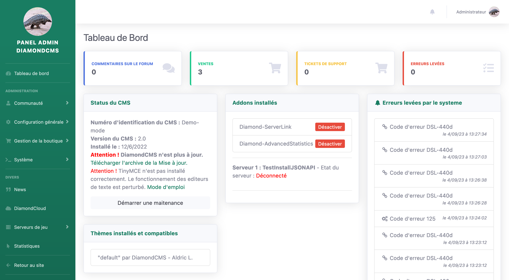

---

##### Some links

+ [Official Website](https://aldric-l.github.io/DiamondCMS/)
+ [Github](https://github.com/Aldric-L/DiamondCMS)

<!--+ [Data](https://1drv.ms/f/s!An5zxDZ6MkIwo4JOOjl38hN-FeKA-A?e=pnTXqT)-->
---

##### Abstract

DiamondCMS is a free content manager software (CMS) that aims to enable people with zero programming background to build complex websites that can interact with game servers using a secure TCP-IP communication channel. It is written in PHP with a custom static page builder engine. DiamondCMS offers a user-friendly and modular platform for server administrators to build websites, manage content, and enhance player engagement. Key features include integrated tools for managing in-game purchases, player statistics, and rankings, as well as customization options to tailor the experience to a community's unique needs. With its intuitive interface and open-source nature, DiamondCMS has become a valuable resource for server owners looking to establish a professional and interactive online presence. 

---

##### Future of the project

I was writing this project before initiating my research activity that now occupies most of my time. DiamondCMS took 2 years of development, with community feedbacks and is now made of more than 1 million of code lines. The project is now open-sources and I only make sure that no major vulnerabilities appear. I leave the development of new features to the community that can write addons or directly edit the engine. 

---

##### Figure 1: The default front page

##### Figure 2: The default admin panel

<!-----

##### Related material

+ [Presentation slides](presentation2.pdf)
+ [Wikipedia entry](https://en.wikipedia.org/wiki/The_Finer_Points_of_Sausage_Dogs)-->
