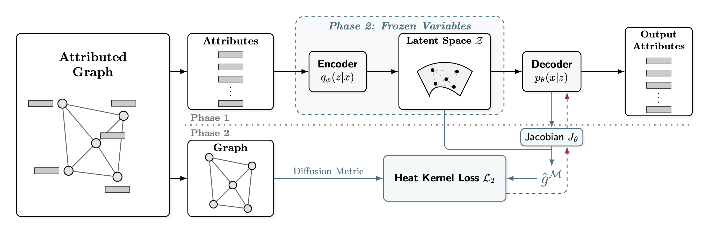
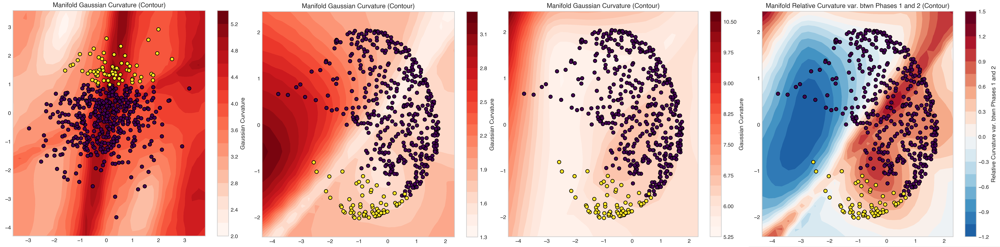
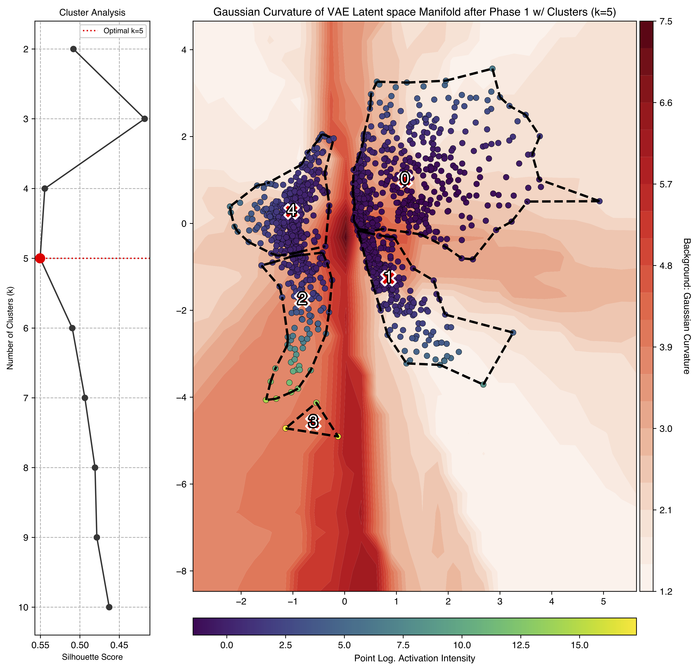

---


##### Download

+ [Paper and mathematical appendices (arXiv)](https://arxiv.org/abs/2601.22806)
+ [Code and generator](https://github.com/Aldric-L/Aligning-the-Unseen-in-Attributed-Graphs)

---

##### Abstract

Representation learning on attributed graphs relies on the alignment of graph geometry and node attributes geometry. We argue that this assumption obscures critical structural information, particularly in heterophilic or noisy networks where these geometries naturally conflict. In this work, we introduce a novel Variational Autoencoder (VAE) framework that decouples manifold learning from structural alignment, measuring the geometric deformation required to match the graph's Heat Kernel constraints. We enable the end-to-end optimization of this metric misalignment via novel and differentiable approximation techniques of Riemannian geodesics. Our experiments demonstrate that this geometric tension serves as a powerful structural descriptor, successfully identifying non-homophilic connectivity and anomalies in both synthetic benchmarks and real-world transportation networks.

---

##### Figure 1: Our architecture



##### Figure 2: Synthetic dataset latent space.



- Panel A: theoretical latent space $Z$; 
- Panel B: estimated latent space after Phase 1; 
- Panel C: estimated latent space after Phase 2; 
- Panel D: estimated curvature changes between Phases 1 and 2. 

Nodes are plotted in dark purple for normal nodes, and in yellow for perturbed ones.

##### Figure 4: Phase 1 Latent manifold clustering



Points are colored according to the log. robust z-score of the variation between Phase 1 and Phase 2 of the total pairwise distances with respect to other nodes.

---

##### Citation

Labarthe, A., & Bouffanais B. & Randon-Furling J. (2026). Aligning the Unseen in Attributed Graphs: Interplay between Graph Geometry and Node Attributes Manifold. arXiv preprint arXiv:2601.22806. https://arxiv.org/abs/2601.22806

```BibTeX
@article{labarthe2026aligning,
  title={Aligning the Unseen in Attributed Graphs: Interplay between Graph Geometry and Node Attributes Manifold},
  author={Labarthe, Aldric and Bouffanais, Roland and Randon-Furling, Julien},
  journal={arXiv preprint arXiv:2601.22806},
  year={2026}
}
```
