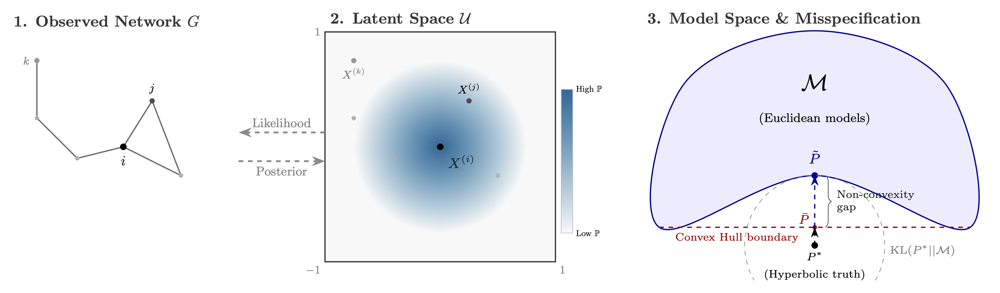

---

<div style="padding: 15px; border: 1px solid var(--tertiary); border-radius: 8px; background-color: var(--code-bg); margin-bottom: 20px;">
    🎉 <b>Update:</b> This paper was presented as a Contributed Talk at CompleNet 2026 at Zaragoza in Spain on May 2026, the 6th. 

</div>

##### Download

+ Paper and mathematical appendices (arXiv -> submitted)
+ [CompleNet 2026 Presentation](complenet2026.pdf)
+ [Code and experiments](https://github.com/Aldric-L/Bayesian-Latent-Space-Models-for-Graphs-are-misspecified)

---

##### Abstract

Bayesian latent space models offer a principled approach to network representation, but rely on correct specification of both geometry and link function. Real-world networks often violate these assumptions, exhibiting geometric mismatch and structural anomalies that break standard metric properties. We show that such misspecification pushes the data-generating distribution outside the model class, causing Bayesian inference to become overconfident and poorly calibrated. To address this, we propose a generalized posterior framework for random geometric graphs. We introduce Link-Sequential R-SafeBayes, a method that exploits dyadic conditional independence to estimate prequential risk and adaptively tune posterior regularization. Experiments on synthetic and real-world networks demonstrate improved calibration, better link prediction performance, and a reliable criterion for selecting latent geometries across Euclidean, spherical, and hyperbolic spaces.

---

##### Figure 1: The Misspecification issue



---

##### Citation

Labarthe, A. (2026). Bayesian Latent Space Models for Graphs Are Misspecified: Toward Robust Inference via Generalized Posteriors. arXiv preprint arXiv:2605.XXXX. https://arxiv.org/abs/2605.XXXX

```BibTeX
@article{labarthe2026misspecification,
  title={Bayesian Latent Space Models for Graphs Are Misspecified: Toward Robust Inference via Generalized Posteriors},
  author={Labarthe, Aldric},
  journal={arXiv preprint arXiv:2605.XXXX},
  year={2026}
}
```
