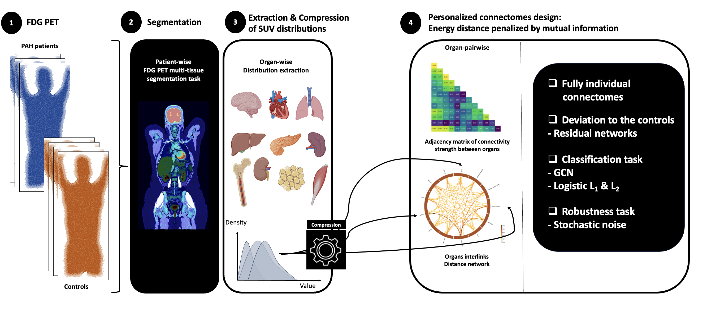

---

<div style="padding: 15px; border: 1px solid var(--tertiary); border-radius: 8px; background-color: var(--code-bg); margin-bottom: 20px;">
    🎉 <b>Update:</b> This paper was published in <i>Communications Medicine</i> on March 27, 2026. 
    <a href="https://www.nature.com/articles/s43856-026-01549-y">Read the final version here (Gold Open Access).</a>
</div>


##### Download

+ [Paper](https://www.nature.com/articles/s43856-026-01549-y)
+ [Code](https://github.com/Aldric-L/Personalized-PET-Connectomes)
+ [Supplementary material](supp.pdf)

--- 

I am deeply grateful to:
- The Orsay Statistics team (Sylvain Faure, Suzanne Varet) who helped me on the statistical framework and provided the necessary compute time;
- The Hôpital Bicêtre pulmonary team (Prof. Laurent Savale et al.) for providing the patient cohort;
- Florent Besson for his trust and guidance throughout this project.

---

##### Abstract

**Background** Immuno-inflammation and systemic alterations are key features of chronic diseases. While PET molecular imaging is widely used in precision medicine, conventional analyses are lesion-centric, focusing on detection, localization, and quantification. Such approaches overlook disease-induced homeostatic changes occurring at the whole-body level. Recently, PET connectomics has emerged as a graph-based method to characterize metabolic crosstalk between organs. In this study, we introduce a framework for generating individualized PET-based connectomes, enabling robust assessment of personalized systemic homeostasis.
Methods

**Methods**
We analyzed routine PET imaging data from a tertiary care center, including patients with advanced systemic disease (N = 22 highly selected patients with Group I advanced pulmonary arterial hypertension) and 46 matched controls. Our computational framework captures the voxel-wise distributional profile of radiotracer uptake within organs, rather than relying on summary measures. Pairwise metabolic distances between organ distributions were used to construct subject-specific, whole-body metabolic networks - termed connectomes. Machine learning and statistical modeling were applied to evaluate the ability of these networks to distinguish disease states and map multi-organ metabolic interactions.
Results

**Results**
Here we show that this framework successfully generates stable, individualized metabolic networks from a single PET scan. A graph-based classifier differentiates patients from controls with 75% accuracy. Notably, metabolic connections involving the right heart emerge as the primary drivers of disease discrimination, consistent with the known pathophysiology of advanced pulmonary arterial hypertension. Group-level analyses corroborate these findings, revealing specific alterations in network connectivity.
Conclusions

**Conclusions**
Personalized PET-based connectomics can detect individual-level homeostatic perturbations using standard imaging protocols. This non-invasive approach offers a promising strategy to characterize the systemic impact of chronic diseases and represents a shift from population-level analyses toward truly personalized metabolic phenotyping.
Non-technical summary


##### Non-technical summary
Chronic diseases affect how the body regulates and maintains function. Imaging scans such as PET scans are commonly used to detect and map diseases within the body, but traditional analyses tend to seek specific disease-related changes, such as cancers. We developed an approach to explore patient-level alterations in how different body organs communicate with each other. This method generates individualized “maps” representing possible relationships between organs for each patient. We applied it to PET data from patients with advanced pulmonary arterial hypertension, a disease in which the blood vessels supplying the lungs narrow, thicken and stiffen, and matched healthy people. People with pulmonary arterial hypertension had different maps of organ interactions compared to healthy people, that were as expected from what is known about the disease. Our approach may help identify subtle, whole-body changes in body regulation detectable via PET to better understand how the body changes in people with different chronic diseases.

---

##### Visual Summary



---

##### Citation

Labarthe, A., Varet, S., Savale, L. et al. Personalized mapping of body homeostasis using whole-body PET connectomics and routine FDG PET imaging. Commun Med (2026). https://doi.org/10.1038/s43856-026-01549-y

```BibTeX
@article{labarthe2026personalized,
  title={Personalized mapping of body homeostasis using whole-body PET connectomics and routine FDG PET imaging},
  author={Labarthe, Aldric and Varet, Suzanne and Savale, Laurent and Montani, David and Humbert, Marc and Faure, Sylvain and Besson, Florent L},
  journal={Communications Medicine},
  year={2026},
  publisher={Nature Publishing Group UK London}
}
```
